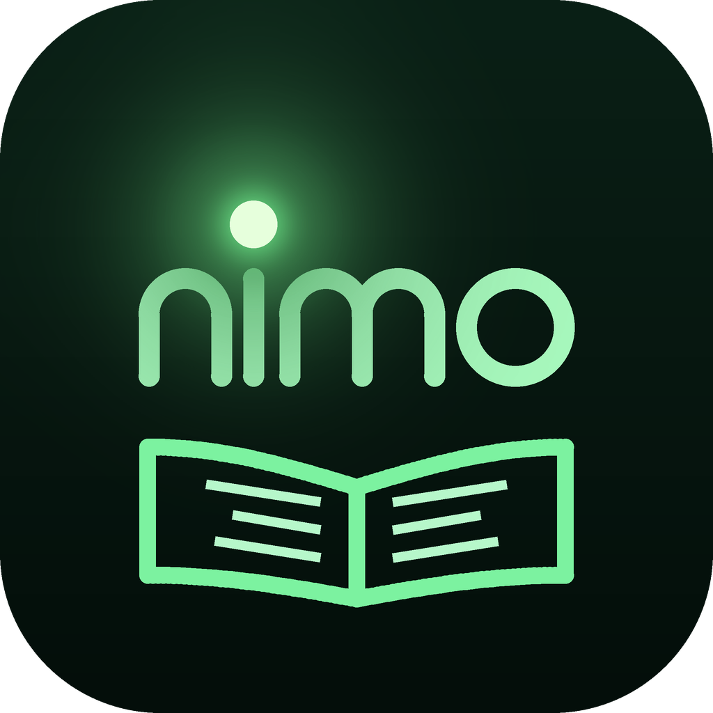
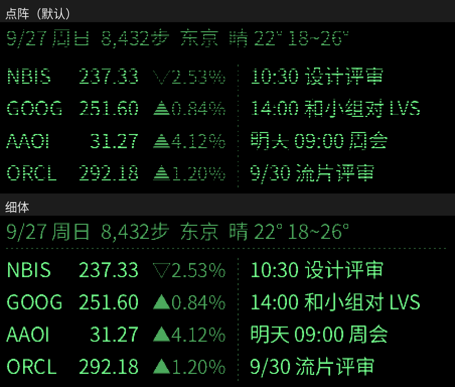

# 萤读 Yingdu —— Nimo 智能眼镜的第三方伴侣 app



取名自「囊萤夜读」：Nimo 的单色绿光显示，像一只停在眼前的萤火虫。

萤读是一个独立的 Android app，通过蓝牙直接控制 **Nimo 智能眼镜**（固件 V0.1.1.4 实测），
在眼镜上看小说、看自己排版的信息看板，并把手机通知弹到眼镜上。翻译和导航交给 Nimo 官方 app（一键切换）。

萤读不申请手机的麦克风权限：需要听声音的功能（全天记忆、实时字幕）只用眼镜自己的麦克风。

> 非官方项目，与 Nimo 厂商无关。协议来自开源项目 MentraOS 的驱动，并在实机上测试过，固件更新后可能失效。

## 功能

| 功能 | 说明 |
|---|---|
| 阅读 | TXT（自动识别 UTF-8 / GBK）、EPUB（读取书内目录，含多级章节）、MOBI / AZW3（无 DRM）；字号 12～32px 每 1px 一档（16px 时一屏 7 行 × 27 字）；自动滚动（每 N 秒前进 M 行）；进度自动保存 |
| 看板 | 卡片插件：股票、日程待办、天气预报、倒数日、世界时钟、像素表盘、番茄钟、今日回顾、附近景点、网络卡片（任意网址）；可开关、排序，两张一屏并排，多屏自动轮换；顶部日期、步数、城市、天气；显示 N 秒后自动收起 |
| 股票 | 雅虎财经搜索、自选列表排序；美股接近实时，含盘前、盘后、夜盘（微牛行情）；日股 / 港股约延迟 15～20 分钟 |
| 日程待办 | 读取手机日历 + app 内待办 |
| 通知 | 读取手机通知，按 app 和时段转发到眼镜自带的通知弹窗（显示 app 图标）；来电提醒；眼镜断线期间的通知连上后补弹 |
| 像素表盘 | 翻页钟（整分钟翻页，有翻到一半的一帧）、数码管（不亮的段微亮，可显示秒）、二进制钟（8421 码，带读数）；全屏或看板卡片 |
| 番茄钟 | 眼镜上 60 格的像素进度环 + 剩余时间；专注 / 短休息 / 长休息时长可调；时间到了眼镜弹提醒、进度环弹一下；后台计时，锁屏不影响 |
| 聚会工具 | 骰子（1～6 个）、抽签（自己写签，抽过不重复）、真心话大冒险（各 30 题）；结果只画在眼镜上，手机和通知栏都看不到 |
| 小游戏 | 2048、贪吃蛇、俄罗斯方块、扫雷、数独、数字华容道、推箱子、五子棋（人机）、记忆翻牌；手机当手柄（方向键 + A、B 键） |
| 眼镜设置 | 息屏模式、抬头显示、自动亮度、亮度 |
| 字体 | 点阵字：16～23px 用 16 点阵（Unifont，字形和眼镜自带界面一致），其余用 12 点阵（Fusion Pixel）放大；逐像素绘制、最近邻缩放，笔画不发糊 |
| 全天记忆 | 只用眼镜麦克风、只在有人说话时录（一直开 / 间歇开麦两种方式）；录音转文字（OpenAI 兼容接口，默认硅基流动 SenseVoice；也支持阿里百炼 Qwen3-ASR-Flash），**转好文字就删录音，手机上只留文字**；分辨自己和别人；每晚用大模型总结（Claude 或 OpenAI 兼容接口）：概要、待办、聊过的事、值得记住的；记忆检索（关键词搜索所有天的文字和回顾，或用大模型直接问）；看板「今日回顾」卡片 |
| 实时字幕 | 眼镜麦克风听到的话转成文字显示在眼镜上，能分出自己说的 |
| 景点介绍 | 按精确位置每 15 / 30 分钟查附近 3 公里的景点（高德地图 / Google 地图，同一景点里的展厅、打卡点只算整体），介绍来自百度百科或维基百科，在眼镜上逐个弹出一屏介绍；看板「附近景点」卡片从近到远列出 |
| 使用手册 | 首页「功能 → 使用手册」：每个功能怎么用、Key 怎么申请、常见问题；设置页右上角「说明」直接跳到对应的一页 |
| 翻译 / 导航 | 一键把眼镜交给 Nimo 官方 app 使用 |



## 网络卡片格式

网络卡片会定时请求你填的网址（填了请求体就用 POST，否则 GET；请求头每行一个「名称: 值」），把返回内容显示成看板上的一张卡片：

- **纯文本**：每行一项；用 ` | ` 或 Tab 分成左、中、右三列（中、右两列右对齐）；以 `□ ` 开头的行画成待办方框。
- **JSON**：`{"rows": [...]}` 或直接一个数组，每项可以是字符串、`["左", "中", "右"]`，或 `{"left": "…", "mid": "…", "right": "…", "todo": false}`。

例如接 Home Assistant：网址 `http://家里的地址:8123/api/template`，请求头 `Authorization: Bearer 长期访问令牌`，请求体

```json
{"template": "客厅 | {{ states('sensor.living_room_temperature') }}°\n空调 | {{ states('climate.living_room') }}"}
```

## 安装

直接安装 [`releases/`](releases/) 里最新的 `Yingdu-v*.apk`（Android 8.0+，推荐 Android 12+）。
这是作者自签名的安装包，安装时需要允许"未知来源"。

**第一次使用：**
1. 用 Nimo 官方 app 配对过眼镜（系统里要有这台已配对设备）；
2. 在系统设置里**强行停止官方 app**（眼镜同一时间只能连一个 app）；
3. 打开萤读，点「连接」，按提示授予蓝牙、通知、定位（天气）、日历、步数等权限。

从官方 app 切回萤读：「我的」→「设备」→「停止官方 app」→ 强行停止 → 返回点「连接眼镜」。

## 从源码构建

### 方式一：Android Studio（推荐）
用 Android Studio 打开仓库根目录，等 Gradle 同步完成后 Run 即可（AGP 8.5 / Kotlin 1.9 / compileSdk 34）。
注意：Studio 用的是它自己的调试签名，和 releases 里的安装包签名不同，覆盖安装前要先卸载。

### 方式二：不用 Android SDK 的命令行脚本
作者开发环境里没有 Android SDK，发布版是用下面这套工具链打包的（`tools/`）：
1. `kotlinc` 以 Java 8 字节码编译（`-jvm-target 1.8 -Xlambdas=class -Xsam-conversions=class`，避免 invokedynamic），classpath 用 `android.jar`（API 34）；
2. 用 dex2jar 自带的 `dx` 把 app 的 class 和 Kotlin 标准库转成 `classes.dex`；
3. `python3 tools/build_apk.py out.apk`：用 pyaxml 生成二进制清单（属性按资源 ID 排序，版本号取自 `app/build.gradle.kts`）、`tools/arsc.py` 生成只含图标的 resources.arsc、4 字节对齐、自己实现 APK 签名方案 v2。

眼镜用的点阵字体由 `tools/make_pixel_fonts.py` 从 Unifont 和 Fusion Pixel Font 转换生成（用法见脚本开头），换字体或调整收录范围时重新运行即可。
   签名密钥默认放在 `~/.yingdu/`（第一次运行自动生成）。**不要把密钥提交到仓库。**

## 目录结构

```
app/src/main/java/io/github/yingdu/
  NimoProtocol.kt     帧格式、CRC、分片、图片编码、提词器格式
  NimoClient.kt       蓝牙连接、握手、页面切换、发文字/图片、通知弹窗、眼镜设置
  ReaderService.kt    前台服务：书、看板、股票、天气、步数、日程、通知转发
  MainActivity.kt     界面（纯代码；首页 / 看板 / 我的，功能和设置在一层层的子页面里）
  Book.kt / Formats.kt  TXT / EPUB / MOBI 解析与按行排版
  DashboardImage.kt / ReaderImage.kt / Fonts.kt / PixelFont.kt  眼镜画面绘制（452×170，2bpp，点阵字）
  DashCards.kt        看板卡片（插件）：卡片类型、各卡片内容、网络卡片格式解析、分屏
  Apps.kt             眼镜全屏功能的框架（GlassesApp、画面工具 Frame）
  PhoneIcons.kt       手机首页「功能」的像素图标
  AudioClean.kt       转文字前的录音清理：按说话响度自动调音量、降噪、提前量限幅（有单元测试）
  NoiseReducer.kt     维纳滤波降噪（STFT、按最安静的帧估计底噪、决策导向平滑），转文字用（有单元测试）
  Sights.kt           景点介绍：高德 / Google 周边搜索、子点合并、百度百科 / 维基百科介绍、裁成一屏（有单元测试）
  PixelClock.kt / Clock.kt  像素表盘：翻页钟、数码管、二进制钟的点阵画法（有单元测试）/ 全屏表盘
  Pomodoro.kt         番茄钟：计时规则（有单元测试）、进度环画面、到点提醒
  Party.kt            聚会工具：骰子、抽签、真心话大冒险（规则有单元测试）
  Games.kt            小游戏的眼镜画面和手柄操作
  GameLogic.kt        小游戏的规则（不依赖 Android，有单元测试；推箱子每关都验证过有解）
  MicAudio.kt         眼镜麦克风：音频包解析、Opus 解码（Concentus）、Ogg 封装（有单元测试）
  Vad.kt              有没有人在说话（能量高于底噪 + 基频周期性，有单元测试）
  Memory.kt           全天记忆：录音引擎（只用眼镜麦克风）、按天存文字、转完删录音、Ogg → WAV、记忆检索（有单元测试）
  Speaker.kt          分辨自己和别人（音量、音高、低频比例）
  Captions.kt         实时字幕
  MemoryAi.kt         转文字（OpenAI 兼容）、每天总结（Claude Messages API / OpenAI 兼容）
  Stores.kt / Steps.kt / Dashboard.kt / PhoneNotifications.kt / OfficialApp.kt
app/src/main/assets/fonts/  点阵字体（.ydpf）及 OFL 许可证
app/src/test/               协议（与实机收发的帧逐字节比对）和排版的单元测试
tools/                      命令行打包脚本、点阵字体转换脚本、图标生成脚本
samples/                    测试用小说（原创内容，UTF-8 / GBK 两种编码）
releases/                   发布的安装包
```

## 致谢与许可

- 协议常量、帧编解码和连接流程移植自 [MentraOS](https://github.com/Mentra-Community/MentraOS)（Apache License 2.0），见 `NOTICE`。
- 字体：16～23px 基于 [GNU Unifont](https://unifoundry.com/unifont/)（SIL OFL 1.1 / GPL 2+ 带字体嵌入例外，双许可，萤读按 OFL 使用），其余字号基于 [Fusion Pixel Font](https://github.com/TakWolf/fusion-pixel-font)（SIL OFL 1.1）；均为子集并转换成萤读自己的点阵格式。许可证见 `app/src/main/assets/fonts/`。
- 眼镜麦克风的 Opus 解码用 [Concentus](https://github.com/lostromb/concentus)（libopus 的纯 Java 移植，BSD 3-Clause），见 `NOTICE`。
- 全天记忆：转文字和总结由用户自己选择服务、填自己的 API Key；录音转好文字就删，手机上只留文字。
- 景点介绍：默认关闭；打开后查询时把当前坐标发给你选的地图服务（高德或 Google）、把景点名发给百度百科 / 维基百科，不发给其他地方。
- 数据来源：雅虎财经（行情、搜索，非官方接口）、微牛 Webull（美股盘前 / 盘后 / 夜盘，非官方接口）、Open-Meteo（天气、城市搜索）、BigDataCloud（反向地理编码）。

## 许可证

萤读以 [Apache License 2.0](LICENSE) 开源：可以自由使用、修改、再发布（包括商用），
再发布时保留 `LICENSE` 和 `NOTICE`、注明改动即可。眼镜点阵字体按 SIL OFL 1.1 授权（见 `app/src/main/assets/fonts/`）。
「Nimo」是其所有者的商标，萤读是非官方项目，与厂商无关。
